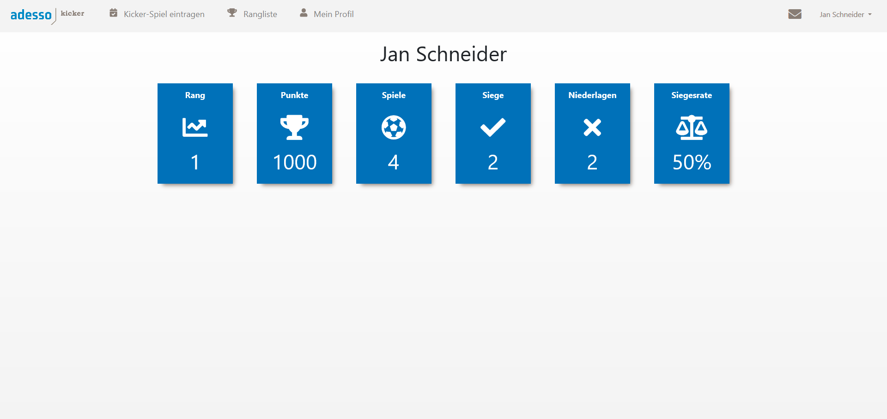

# What is adesso kicker?
Adesso kicker is a web application for adesso coworkers to make playing foosball even more fun and to find out who is the best kicker player.
Each person can login with Keycloak and record the result of matches they have played.
Our web application is sending notifications and email to the other participants, so they can
confirm valid games.
Our internal ranking system based on elo will determine the skill of each person and position them into a ranking list.
You can also look at each players statistics which will be also displayed in various charts at their profiles.

# Screenshots

## Record matches

## Ranking list

## User profile

# Building
Before the project can be build the properties for a Keycloak and SMTP Server have to be set in
`application-prod.properties`

## Docker
To build with docker run `docker build - t tag .`.  
If you want to cache the maven dependencies you can enable experimental docker features and run
`docker build -f experimental.Dockerfile -t tag .`.  
Afterwards run the container with `docker run -d -p external_port:80 tag`.  
If you want to persist logs and database run `docker run -d -p external_port:80 --mount source=kicker_logs,target=/kicker/logs 
--mount source=kicker_db,target=/kicker/db tag`  
This creates the volumes kicker_logs and kicker_db if they don't exist yet and persists logs and the database.  

## Maven
To build with maven you can use the maven wrapper and run `./mvnw package  -DskipTests` (or `mvnw.cmd package -DskipTest`
on Windows) in the root directory to create a jar of the project in `target`.